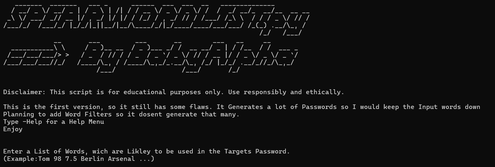

# SpearWordlists.py
Script wich generates Target Individual Wordlists for aimed Bruteforce Attacks, with the Words given to it. (like Names, Birthday and Stuff.}

# Disclaimer
This script is for educational purposes only. Use responsibly and ethically.

# Features
- Generates all combinations of input words (with upper/lowercase variants)
- Adds special characters at word boundaries
- Generates Passwords with your choosen lenght
- New one word Mode wich adds common Strings like "123456" or "qwerty"
- Checks if Word is mentiond in Rockyou.txt and adds them to your Wordlist.

# !Download Rockyou.txt from Releaeses or elswhere and put it in the same directory as this script!

# Example
Enter a List of Words, wich are Likley to be used in the Targets Password.
(Example:Tom 98 7.5 Paris Arsenal ...)

# Check Releases for older Versions

# Comment
Keeping the Words down for fewer Words and adding them to your normal Wordlist is recommended.

This is my first Github Project and Im still Working on it. 

Please star it tho.

Enjoy

BabyAlpha

